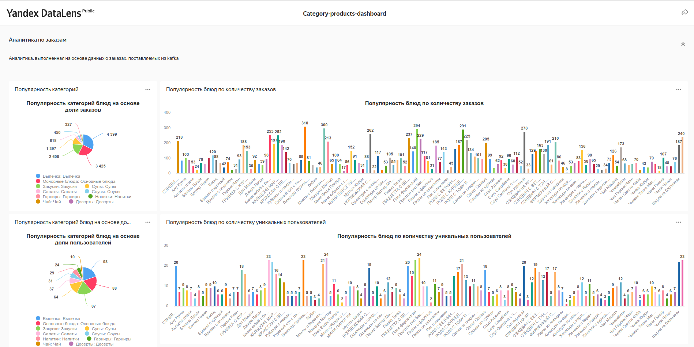

# Проект за 9 спринт

Сервисы в реджистри

```yaml
image:
  repository: "cr.yandex/crpb95qer8edm6efcjde/stg_service"
  pullPolicy: IfNotPresent
  # Overrides the image tag whose default is the chart appVersion.
  tag: "version-1.0"
```

```yaml
image:
  repository: "cr.yandex/crpb95qer8edm6efcjde/dds_service"
  pullPolicy: IfNotPresent
  # Overrides the image tag whose default is the chart appVersion.
  tag: "version-1.0"
```

```yaml
image:
  repository: "cr.yandex/crpb95qer8edm6efcjde/cdm_service"
  pullPolicy: IfNotPresent
  # Overrides the image tag whose default is the chart appVersion.
  tag: "version-1.0"
```

Дашбоард [ссылка](https://datalens.yandex/3wo87v6i3t0qp)


